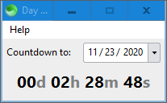

# Day Countdown

A day countdown timer made with [Sciter](https://sciter.com) and written in HTML, CSS, & TIScript based on the following prototype from [this](https://old.reddit.com/r/software/comments/jyv1k5/an_app_which_counts_days_since_a_specific_date/) Reddit thread:

## Preview

## Usage

1. Place the [Sciter](https://sciter.com) executable [scapp.exe](https://github.com/c-smile/sciter-sdk/tree/master/bin.win/x64) inside this folder.

2. Run `scapp.exe`.